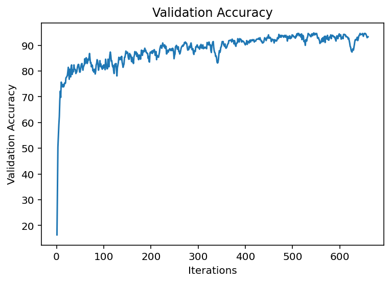

# CNN Classifier - AlexNet

### Problem Statement

The task for this assignment is to test your designed neural network models for image classification problem and classify the remotely sensed images using deep learning architectures. There are 7 classes: Basketball court, beach, forest, railway, tennis court, water pool, others

### Data Preprocessing 

The given training set had 560 images. Data Augmentation has been used to optimize the dataset. Augmentor library for python has been used for the task. Final training set has 3080 images. [Code](GNR_638_Kaggle_DataPreprocessing.ipynb) for the Augmentor. Some augmentation tasks performed are as follows

`p.rotate(probability=0.7, max_left_rotation=10, max_right_rotation=10)`

`p.zoom_random(probability=0.3,percentage_area =0.8, randomise_percentage_area=True)`

`p.flip_left_right(probability=0.4)`

`p.flip_top_bottom(probability=0.4)`

`p.random_erasing(probability=0.2,rectangle_area=0.8)`

### Model Architecture

AlexNet Model has been implemented for this task with slight modifications.

Framework: Pytorch
[Code](GNR_638_Kaggle.ipynb)

### Result

The model achieved 94% Accuracy on validation set on training for 20 epochs in an batch size of 77 for 2541 images and validation set consisting of 539 images.

### Result

### Loss

